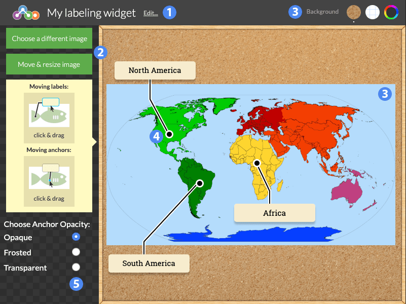

# Labeling #

A quiz tool which requires students to correctly identify certain parts of an image by placing labels.

## Details ##

### Overview ###

1. Title of the widget
2. Image upload, move, and resize options
3. Widget background selection
4. Label anchor and label
5. Anchor opacity settings

### Selecting and Resizing an Image ###

After entering a title for your Labeling widget, you'll be prompted to select an image to use as the background. The Materia media upload dialog allows you to select an image you've previously uploaded, or select a new image from your computer.

Use the "Choose a different image" option to select a new background iamge. You can move or resize the image using the "Move & resize image" option.

To change the background texture, use the Background option on the top-right. You can select from a cork-board background, a white-with-blue grid reminiscent of graph paper, or a single uniform color using the color picker.

### Adding Labels ###

Add labels to your widget by clicking anywhere on the background image. You can drag the label's anchor by clicking and dragging it. Similarly, you can move the label around by clicking and dragging the label itself. You can use this to make sure the label doesn't obscure other anchors or important parts of the image.

Click once within a label to add text to it.

### Anchor Opacity ###

The Anchor Opacity options on the bottom-left allow you to change how the label anchors will appear when students interact with your widget. By default, anchors appear opaque: as white dots with a black border. "Frosted" makes them semi-transparent. "Transparent" makes the anchors invisible altogether. Labels will still snap to an anchor when dragged within its vicinity.
